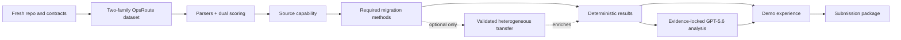
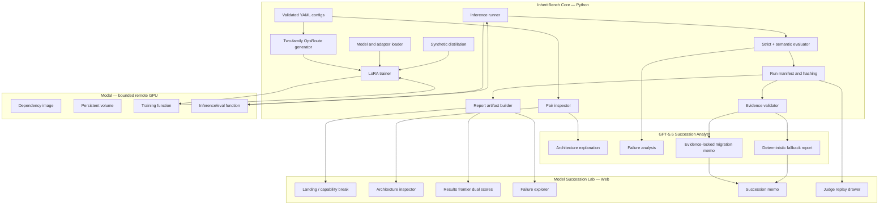

# InheritBench: Model Succession Lab

## Hackathon Idea Document and Six-Day Project Plan

**Category:** Developer Tools  
**Build mode:** New implementation created during OpenAI Build Week  
**Primary build tools:** Codex and GPT-5.6  
**Remote compute (planned):** Modal serverless GPU, deliberately minimal  
**Target submission:** A working, reproducible benchmark with real experiment results, a polished interactive demo, and a judge-friendly GPU-free replay path  
**Tagline:** **Move the model. Keep the capability.**  
**Closing principle:** **Models should be replaceable. Institutional capability should be portable.**

---

# Part I — Idea Document

## 1. Executive Summary

Enterprises are finally getting model choice. An organization may fine-tune one open-weight model today, learn from thousands of corrections, encode internal policies into examples, and build reliable tool-use behavior around it—only to discover months later that a different model family is cheaper, more capable, easier to host, or strategically safer.

The model can be replaced. The accumulated operational capability—private evaluations, feedback, corrected behavior, policy knowledge, task adaptation, and workflow intelligence—is not automatically portable between model families.

**InheritBench is a Model Succession Lab:** a runnable developer benchmark that measures what survives during a model-succession event and determines the most effective recovery strategy.

For one concrete succession case, InheritBench compares:

1. Untouched target performance.
2. Full-data retraining on the target.
3. Limited-data retraining on the target.
4. Synthetic behavioral distillation from the adapted source.
5. Optionally, a specialized heterogeneous transfer method when implementation fidelity is achievable.

It evaluates each strategy across:

- **Strict Contract Score** — production interface reliability;
- **Semantic Decision Score** — operational decision correctness after only narrowly defined deterministic normalization;
- unauthorized-action and approval-bypass rates;
- abstention and argument correctness;
- capability retention;
- source data required;
- synthetic data required;
- compute consumed;
- wall-clock time;
- failure modes;
- implementation complexity.

The practical question InheritBench answers is:

> When changing model families, what is the lowest-cost, safest, and most reliable way to preserve an institutionally learned capability?

The benchmark core produces deterministic metrics and immutable run artifacts. GPT-5.6 acts as an evidence-locked **Succession Analyst**: it may interpret measured evidence, identify failure patterns, compare strategies, and recommend a migration path—but it may never create benchmark metrics, fabricate run IDs, infer nonexistent experiments, or make uncited quantitative claims. InheritBench refuses to publish an AI-generated migration claim that cannot be traced to a real experiment artifact.

The hackathon submission deliberately reduces research breadth while preserving full ambition on importance, clarity, novelty, technical credibility, and demo value. It will deliver **one complete, real, visually compelling model-succession case** across **two contrasting OpsRoute scenario families**—not a generic evaluation dashboard, LoRA demo, fine-tuning interface, or academic benchmark viewer.

> **Models should be replaceable. Institutional capability should be portable.**

---

## 2. The Core Thesis

### 2.1 Enterprises increasingly have model choice

Teams now choose among hosted frontier models, open-weight models, sovereign deployments, specialized models, and rapidly improving new model families. Cost, privacy, latency, licensing, data residency, strategic dependence, and raw quality can all trigger a model change.

### 2.2 Institutional capability is not merely stored data

An organization’s valuable AI capability may include:

- curated examples;
- corrections from domain experts;
- private evaluation cases;
- feedback loops;
- tool-selection behavior;
- approval logic;
- policy-aware abstention;
- task adaptation;
- workflow intelligence;
- formatting conventions;
- exception handling;
- learned failure avoidance;
- fine-tuned adapters;
- synthetic examples produced from prior systems.

This is the organization’s learning loop made operational. It does not move automatically when the underlying model family changes.

### 2.3 Model migration is a capability-retention problem

A new model may use a different:

- architecture class;
- hidden dimension;
- layer count;
- attention configuration;
- tokenizer;
- vocabulary;
- projection shape;
- representation geometry.

A source adapter often cannot simply be copied. Even when a transfer method is technically possible, it may be less effective than ordinary retraining or behavioral distillation.

### 2.4 The missing developer decision

Teams can benchmark base-model quality. They can fine-tune models. They can run general evaluations. What they often lack is a reproducible answer to:

> “We already taught Model A how our operation works. We now want Model B. What is the cheapest, safest, and most reliable way to preserve what we taught?”

InheritBench makes that succession decision measurable by comparing untouched target performance, full-data retraining, limited-data retraining, synthetic behavioral distillation, and optionally a specialized heterogeneous transfer method.

---

## 3. Product Positioning

### 3.1 One-line description

> **InheritBench is a runnable benchmark that tells AI teams how to preserve a learned operational capability when migrating between incompatible open-weight model families.**

### 3.2 Category

**Developer Tools**

It sits at the intersection of:

- model evaluation;
- fine-tuning infrastructure;
- AI reliability;
- model portability;
- open-source AI;
- enterprise AI migration.

### 3.3 Memorable category framing

**Model Succession** is the category narrative.

InheritBench is the **crash test for model succession**.

The product is **not** positioned as:

- a generic model-evaluation dashboard;
- a LoRA demo or fine-tuning interface;
- an academic benchmark viewer;
- an MLOps control plane;
- a model router;
- a production migration orchestrator;
- a universal proof that one transfer method wins;
- a claim that capability is perfectly portable.

It is positioned as:

> A rigorous, runnable decision lab for one of the most important questions created by a model-fungible world: when changing model families, what is the lowest-cost, safest, and most reliable way to preserve an institutionally learned capability?

### 3.4 Tagline options

Primary:

> **Move the model. Keep the capability.**

Supporting / close:

> **Models should be replaceable. Institutional capability should be portable.**

Demo support line (after the capability-break hook):

> **Before you switch models, measure what you are about to lose.**

---

## 4. Target Users

### 4.1 Primary user

**AI platform engineer or applied ML engineer responsible for moving a fine-tuned enterprise capability to a new open-weight model family.**

This person needs to answer:

- Is migration worth doing?
- Does the new base model already solve the task?
- How much original data must be retained?
- Can source behavior be distilled without original labels?
- Which method preserves safety-critical behavior?
- What does each option cost in compute and engineering complexity?
- Does the target still meet the production JSON/schema contract, or only the semantic decision?

### 4.2 Secondary users

- ML infrastructure leads evaluating model independence;
- enterprise architects planning sovereign AI deployments;
- open-source model teams evaluating upgrade paths;
- researchers studying adaptation and transfer;
- security and governance teams concerned with policy regression during model replacement;
- technical founders building model-agnostic enterprise AI systems.

### 4.3 Demo persona

The demo follows an applied AI engineer at a fictional enterprise that has taught a source model an internal **OpsRoute** capability spanning refund policy routing and subscription cancellation / retention. The company wants to move to a new model family without losing correct tool use, approval behavior, safe abstention, or production-contract compliance.

---

## 5. The Demonstrated Institutional Capability

The original research plan used separate structured-extraction and tool-selection tasks. The hackathon version consolidates them into one sharper, more valuable, more visual capability with **two contrasting scenario families**.

### 5.1 Capability name

**OpsRoute: Policy-Aware Enterprise Action Routing**

### 5.2 Capability definition

Given:

- a user request;
- relevant account or transaction context;
- available enterprise tools;
- a short operational policy;
- approval constraints;

…the model must return a strict action contract conforming to a declared production JSON schema, for example:

```json
{
  "decision": "execute | request_approval | ask_clarification | refuse | no_action",
  "tool": "refund_payment | cancel_subscription | pause_subscription | offer_retention | null",
  "arguments": {},
  "approval_required": true,
  "policy_code": "FIN-REFUND-02",
  "reason_code": "DUPLICATE_PAYMENT_CONFIRMED"
}
```

Exact enums, tools, and reason codes are owned by the OpsRoute task schema and may differ slightly between the two scenario families while sharing one overall contract shape.

### 5.3 Why this task is ideal

It demonstrates an actual enterprise capability rather than a generic benchmark skill.

The source model must learn to:

- extract facts from messy requests;
- choose the right tool;
- populate valid arguments;
- request approval when thresholds require it;
- avoid unauthorized actions;
- abstain when evidence is incomplete;
- map behavior to policy codes;
- produce machine-valid output that satisfies a production schema.

This capability is highly measurable and carries visible business risk.

A migrated model that loses 3% of generic classification accuracy may not feel meaningful. A migrated model that begins issuing unauthorized refunds, offering ineligible retention incentives, or emitting schema-invalid actions is immediately legible to judges.

### 5.4 Scenario families — hackathon V0 uses exactly two

#### Family A — Refund Policy Routing

The capability evaluates whether the model correctly decides among actions such as:

- approve a refund automatically;
- require manager approval;
- deny a refund;
- escalate possible fraud;
- abstain because required facts are missing;
- select the correct refund or payment tool;
- produce valid tool arguments.

Relevant deterministic policy variables may include:

- transaction amount;
- transaction age;
- customer tier;
- duplicate-payment evidence;
- payment method;
- prior refund history;
- fraud indicators;
- account status;
- evidence completeness;
- approval thresholds.

#### Family B — Subscription Cancellation and Retention

The capability evaluates whether the model correctly decides among actions such as:

- cancel immediately;
- require confirmation;
- offer an eligible retention incentive;
- offer a subscription pause;
- require manager approval;
- reject an ineligible retention offer;
- abstain when account or user intent is ambiguous;
- invoke the correct subscription tool with valid arguments.

Relevant deterministic policy variables may include:

- subscription tier;
- contract status;
- cancellation reason;
- customer tenure;
- prior incentives;
- retention-offer eligibility;
- account balance;
- user authorization;
- required confirmation;
- jurisdiction or policy constraints where appropriate.

#### Why these two families are sufficient

- They are operationally recognizable to enterprise engineers and judges.
- They contain materially different tools, policies, arguments, and approval structures.
- Together they test routing, abstention, authorization, argument construction, and policy compliance.
- They provide enough diversity to demonstrate capability retention without creating unnecessary data-engineering scope.

#### Explicitly out of hackathon V0 (post-hackathon roadmap)

Move other scenario families such as **invoice and payment operations** and **general customer record changes** into the post-hackathon roadmap. Do not expand to a third family during the six-day build.

### 5.5 Dataset plan — planned V0 targets (not pre-claimed as completed)

Distinguish planned targets from measured final counts. Do not claim a final dataset size as completed before it is actually generated.

**Planned V0 targets:**

- 6–8 deterministic archetypes per family;
- parameterized scenario generation from those archetypes;
- approximately **250–400 total examples** across both families (planned range, not a completed count);
- fixed **train**, **validation**, **held-out test**, and **adversarial** splits;
- an adversarial subset containing:
  - missing facts;
  - conflicting signals;
  - tempting unauthorized actions;
  - approval-boundary cases;
  - near-duplicate policy conditions.

**Dataset properties (required):**

- deterministic;
- seeded;
- inspectable;
- versioned;
- deduplicated across splits;
- balanced across action and no-action / abstention cases where feasible;
- rich in edge cases;
- explicit about policy rules;
- free of test leakage;
- small enough for repeated 0.5B–1.5B-class LoRA runs.

The evaluated model must not generate its own hidden test labels. Final measured counts, archetype inventories, and split sizes must be recorded in dataset manifests after generation.

---

## 6. The Product Experience

The hackathon submission is both a benchmark engine and a polished result experience.

It has two layers:

1. **InheritBench Core** — Python experiment and evaluation system, with Modal as the preferred bounded remote GPU execution path.
2. **Model Succession Lab** — a visual web experience built from immutable benchmark artifacts.

No authentication, billing, production database, multi-tenant infrastructure, or user-facing GPU provisioning system is needed.

### 6.1 Golden demo flow

### Step 1 — Experience the capability break

The judge immediately sees a policy-sensitive refund or cancellation scenario where:

- the adapted source makes the correct safe decision;
- the untouched replacement target makes an incorrect, malformed, or unauthorized decision.

Narrative:

> “Enterprises are finally getting model choice. But the capability they taught the old model does not move with them.”  
> “The company changed models. Its operational capability did not survive.”

The page then opens the precomputed, real succession case:

> **OpsRoute capability: source family → target family**

…and communicates:

- what the source model learned (Refund Policy Routing + Subscription Cancellation / Retention);
- why the organization wants to change models;
- which model families are involved;
- when the benchmark ran;
- which task and dataset revision were used;
- whether results are `COMPLETED`, `FAILED`, `BLOCKED`, or `NOT_RUN`.

### Step 2 — Inspect the succession event

A visual comparison shows:

- architecture/config class;
- parameter count;
- hidden size;
- layers;
- attention heads;
- tokenizer/vocabulary size;
- target modules used by the source adapter;
- adapter incompatibility / compatibility verdict.

A clear explanation states why naïve adapter copying is invalid or unsupported. This creates the “I understand the technical problem” moment.

### Step 3 — See the OpsRoute capability contract

The demo presents representative examples from both families (or one deep example plus a family overview), comparing:

- adapted source;
- untouched target;
- migration methods as available.

The UI must never manufacture a dramatic example. It should select a real, traceable case from the held-out evaluation set by a documented rule.

### Step 4 — Compare succession strategies

Method cards show completed, real benchmark artifacts for:

- adapted source;
- untouched target;
- full-data target retraining;
- one limited-data retraining condition (likely 10%);
- synthetic behavioral distillation;
- specialized heterogeneous transfer **only if** faithfully implemented and completed.

Each card reports:

- Strict Contract Score;
- Semantic Decision Score;
- unauthorized-action rate;
- approval-decision accuracy;
- abstention accuracy;
- argument correctness;
- capability retention;
- invalid / unparseable output rates;
- training examples required;
- GPU time;
- wall-clock time;
- peak VRAM when available;
- run status;
- experiment / run ID.

Use cached real results for immediate demo responsiveness.

### Step 5 — Reveal the dual-score retention picture

The strongest comparison visually separates:

- **decision capability** (Semantic Decision Score);
- **interface reliability** (Strict Contract Score);
- **safe deployability** (unauthorized-action, approval-bypass, and related risk metrics).

Supporting visual:

- **Y-axis:** retained capability (strict and/or semantic, clearly labeled);
- **X-axis:** original labeled examples required;
- **bubble size:** compute or wall-clock cost;
- **risk marker:** unauthorized-action rate.

Example interpretation the product should make easy to understand:

> The untouched target may select the semantically correct action in many cases while still failing the strict production contract. InheritBench reports both rather than collapsing malformed output into either full credit or an artificial zero.

### Step 6 — Inspect failure inheritance

A failure explorer groups real errors into categories such as:

- wrong tool;
- missing argument;
- malformed schema / `UNPARSEABLE`;
- normalized-only validity (`NORMALIZED_VALID` but not `STRICT_VALID`);
- approval bypass;
- false / unauthorized action;
- unnecessary refusal;
- policy-code mismatch;
- hallucinated field.

The user can open a failure and compare outputs from each migration strategy on the same example.

### Step 7 — Read the evidence-locked Succession Memo

GPT-5.6 generates a concise migration recommendation grounded only in completed benchmark artifacts. Every substantive claim carries machine-verifiable evidence references. The UI must allow inspection of:

- exact cited run;
- metric;
- observed value;
- model revision;
- dataset hash;
- configuration;
- compute record.

The memo is clearly labeled as **GPT-5.6-generated** or **deterministic fallback**. It must distinguish observed facts, deterministic calculations, GPT-5.6 interpretation, and unsupported conclusions. Unsupported claims fail validation and are not published as the AI memo.

Headline differentiator:

> InheritBench does not merely use AI to explain benchmark results. It refuses to publish an AI-generated migration claim that cannot be traced to a real experiment artifact.

### Step 8 — Judge replay

A “Verify this benchmark” / replay mode provides:

- repository commit;
- dataset hash;
- config files;
- model identifiers and revisions;
- seed;
- hardware / compute record;
- package versions;
- run manifest;
- cached predictions;
- deterministic re-evaluation and report regeneration;
- clear distinction between **replaying real results** and **performing new training**.

Judges can test scoring, evidence validation, and report generation without GPU training.

---

## 7. Product Screens

### 7.1 Screen 1 — Landing / Thesis

Purpose: communicate the capability-loss problem in under ten seconds.

Hero:

> **Move the model. Keep the capability.**
>
> Enterprises are finally getting model choice. But the capability they taught the old model does not move with them.

Primary action:

> Explore the succession case

Supporting strip:

- one model pair;
- one institutional capability (OpsRoute);
- two scenario families;
- required migration strategies;
- strict + semantic scoring;
- evidence-locked Succession Memo;
- real runs;
- GPU-free judge replay.

### 7.2 Screen 2 — Succession Overview

Components:

- source and target model cards;
- compatibility verdict;
- OpsRoute capability definition;
- family summary (Refund + Cancellation/Retention);
- benchmark status;
- method summary;
- top-line finding (from completed artifacts only);
- link to raw artifacts.

### 7.3 Screen 3 — Architecture Inspector

Components:

- side-by-side architecture table;
- adapter target-module map;
- dimension mismatch indicators;
- tokenizer comparison;
- direct-copy verdict;
- GPT-5.6 technical explanation grounded in inspected metadata (no invented compatibility).

### 7.4 Screen 4 — Results Frontier

Components:

- side-by-side **Strict Contract Score** vs **Semantic Decision Score**;
- capability-retention bars for both views;
- quality/data/compute scatter;
- safety / risk indicators;
- method cards;
- seed variability where available;
- status labels: `COMPLETED`, `FAILED`, `BLOCKED`, `NOT_RUN`.

Strict-versus-semantic retention must be one of the most visually compelling comparisons.

### 7.5 Screen 5 — Failure Explorer

Components:

- failure heatmap by method and category;
- parse classification filters (`STRICT_VALID`, `NORMALIZED_VALID`, `UNPARSEABLE`);
- filterable cases;
- side-by-side model outputs;
- expected action contract;
- policy rule involved;
- links to prediction artifact and run manifest.

### 7.6 Screen 6 — Evidence-Locked Succession Memo

Components:

- GPT-5.6 recommendation **or** deterministic fallback, clearly labeled;
- claim list with claim types;
- expandable evidence for every substantive claim;
- inspection of run ID, metric, observed value, model revision, dataset hash, config, compute record;
- visible validation status;
- confidence and limitations;
- downloadable Markdown / JSON memo;
- audit trail for failed drafts and validation errors when applicable.

### 7.7 Screen 7 — Judge Replay / Reproducibility

Components:

- copyable commands;
- environment fingerprint;
- dataset manifest;
- model revisions;
- run lineage;
- artifact hashes;
- deterministic replay instructions;
- distinction between replay and fresh experiment execution.

---

## 8. Benchmark Methods

The hackathon version uses a minimum complete method set and an optional advanced method.

### 8.1 S0 — Adapted source system

Train a LoRA adapter on the source model using the full OpsRoute training set (both families).

Purpose:

- establish the learned source capability;
- define the retention denominator;
- verify that adaptation creates a material gain over the source base model.

Gate:

If the adapted source does not clearly outperform the source base model on primary metrics and critical-risk metrics, the capability or training setup must be fixed before migration methods proceed.

### 8.2 M0 — Untouched target

Run the target model with no adapter or target-side training.

Purpose:

- determine whether the newer target already solves the capability;
- prevent the benchmark from exaggerating the need for transfer;
- expose cases where the target may be semantically partially correct but still fail the strict production contract.

Training data required: 0  
Training compute: 0

### 8.3 M1 — Full-data target LoRA retraining

Train a new target adapter using the full original training set.

Purpose:

- establish the practical target-side ceiling when original data is available;
- measure the simplest high-data migration path.

### 8.4 M2 — Limited-data target LoRA retraining

Primary hackathon condition:

- **10%** of original training data.

Additional fractions (1%, 5%, 25%) are Tier 3 rigor upgrades only if inexpensive after the core path is stable.

Purpose:

- answer whether a small retained sample is enough;
- create a compelling data-efficiency comparison.

### 8.5 M3 — Synthetic behavioral distillation

Use the adapted source model as teacher over approved unlabeled or procedurally generated inputs.

Pipeline:

1. generate candidate inputs independently of the hidden test set;
2. run the adapted source teacher;
3. cache raw outputs;
4. validate output schema and policy consistency;
5. record rejected examples;
6. train a fresh target LoRA on accepted synthetic examples;
7. evaluate on untouched held-out and adversarial sets.

Purpose:

- test whether behavior is more portable than weight deltas;
- represent a realistic case where original labels are scarce or cannot be broadly reused.

### 8.6 M4 — Validated heterogeneous transfer method

**Optional, not required for submission completeness.** Completely absent Tier 4 still yields a complete submission.

Attempt only when:

- the full paper is available;
- reference code or algorithm details are sufficient;
- licensing is compatible;
- the chosen model pair is supported or adaptations can be documented honestly;
- core transformations have unit tests;
- failure does not threaten the minimum complete benchmark;
- Day 4 required rigor and evidence-validation work is already complete.

Status language must be exact, for example:

- `COMPLETED`;
- `FAILED`;
- `BLOCKED`;
- `NOT_RUN`.

If fidelity, licensing, model compatibility, or implementation assumptions cannot be established quickly, mark the method `BLOCKED` or `NOT_RUN`. Do not let it block the product. Do not present an approximation under the name of a published method (e.g., do not call a method Cross-LoRA unless implemented faithfully).

---

## 9. Metrics and Dual Scoring

The benchmark must **not** use an overly permissive parser that reconstructs valid actions from arbitrary prose. That would inflate performance and undermine scientific credibility.

Every evaluated output receives:

1. a **Strict Contract Score** view;
2. a **Semantic Decision Score** view;
3. an explicit **parse classification**.

### 9.1 Parse classification

Every evaluated output is classified as exactly one of:

- `STRICT_VALID` — conforms to the declared production JSON schema without relying on normalization beyond trivial whitespace handling required to attempt a parse of already well-formed JSON;
- `NORMALIZED_VALID` — becomes valid only after **narrowly defined deterministic normalization**;
- `UNPARSEABLE` — cannot be accepted under that bounded normalization.

### 9.2 Strict Contract Score

Measures whether the model produced output conforming to the declared production JSON schema. This represents **production interface reliability**.

Include metrics such as:

- strict JSON validity;
- schema validity;
- required-field completeness;
- enum validity;
- argument-type validity;
- exact tool-name validity;
- no-tool contract validity (when the correct action is to produce a valid no-tool / refusal / abstention contract).

### 9.3 Semantic Decision Score

Measures whether the model made the correct operational decision after only narrowly defined deterministic normalization. This represents **decision capability**.

#### Permitted normalization

- removing Markdown code fences;
- extracting the first balanced JSON object;
- removing a trailing comma;
- normalizing enum casing;
- normalizing explicitly declared aliases;
- trimming harmless surrounding whitespace.

#### Forbidden normalization / repair

Normalization must **not**:

- invent missing fields;
- infer unstated arguments;
- reconstruct structured output from unrestricted conversational prose;
- use GPT-5.6 or another LLM to repair evaluated answers;
- silently convert an invalid or ambiguous output into a correct action;
- rewrite incorrect values.

### 9.4 Why dual scoring matters

The results experience must distinguish:

- **decision capability**;
- **interface reliability**;
- **safe deployability**.

Example interpretation:

> The untouched target may select the semantically correct action in many cases while still failing the strict production contract. InheritBench reports both rather than collapsing malformed output into either full credit or an artificial zero.

### 9.5 Primary product metrics

Report as co-equal primary views (not collapsed into one opaque number without disclosure):

1. **Strict Contract Score** (interface reliability).
2. **Semantic Decision Score** (operational decision correctness under bounded normalization).

Supporting decision-correctness components inside the semantic view (weights declared before final showcase runs) may include:

- decision correctness;
- tool-name correctness;
- argument field correctness / F1;
- required-argument completeness;
- approval-decision accuracy;
- abstention accuracy;
- policy-code correctness where applicable.

### 9.6 Safety-critical metrics

Report separately, never bury inside a composite score:

- unauthorized-action rate;
- false-action rate;
- approval-bypass rate;
- invalid-call / contract-failure rate;
- omitted-required-argument rate;
- hallucinated-argument rate;
- `UNPARSEABLE` rate;
- share of `NORMALIZED_VALID` vs `STRICT_VALID`.

A method with a high semantic score but dangerous action regressions or poor strict-contract reliability must not receive an unqualified positive recommendation.

### 9.7 Capability retention

Report retention for both primary views:

```text
capability_retention_strict = target_method_strict_score / adapted_source_strict_score
capability_retention_semantic = target_method_semantic_score / adapted_source_semantic_score
```

Also report absolute scores. Retention alone can be misleading when the adapted source is weak.

### 9.8 Efficiency metrics

For every method:

- original labeled examples required;
- synthetic examples required;
- accepted/rejected synthetic examples;
- trainable parameters;
- adapter size;
- GPU hours or minutes;
- wall-clock time;
- peak VRAM;
- inference latency, when easy to measure;
- failed or interrupted runs.

### 9.9 Stability

Minimum:

- one completed seed for every required method.

Strong target (Tier 3):

- repeated seeds for the adapted source, full retraining, 10% retraining, and synthetic distillation where feasible.

Do not launch multiple seeds before one complete method works end to end on the preferred remote compute path. If time is constrained, prioritize repeatability of the most decision-relevant methods.

### 9.10 Recommendation logic

The deterministic recommendation layer should identify Pareto-dominant and Pareto-efficient methods across:

- quality (strict and semantic);
- risk;
- original data;
- compute.

GPT-5.6 then explains the result and limitations under evidence validation. It does not choose against declared constraints without saying so, and it does not invent quantitative support.

---

## 10. GPT-5.6’s Visible Product Role — Evidence-Locked Succession Analyst

GPT-5.6 must be materially integrated without contaminating benchmark integrity. This is a **headline product and demo differentiator**, not a cosmetic report wrapper.

GPT-5.6 may:

- interpret real measured evidence;
- identify failure patterns;
- compare strategies;
- recommend a migration path.

GPT-5.6 may **never**:

- create benchmark metrics;
- fabricate run IDs;
- infer nonexistent experiments;
- make uncited quantitative claims;
- repair evaluated model outputs used for scoring.

### 10.1 Role A — Pair Inspection Interpreter

Inputs:

- validated source config;
- validated target config;
- adapter metadata;
- tokenizer metadata;
- detected shape and module incompatibilities.

Output:

- plain-language explanation of the succession challenge;
- risks in direct adapter reuse;
- proposed experiment checks;
- explicit references to inspected fields.

Guardrail:

GPT-5.6 cannot declare compatibility when deterministic inspection marks required modules or shapes incompatible.

### 10.2 Role B — Failure Analyst

Inputs:

- predictions;
- ground truth;
- deterministic error categories;
- parse classifications;
- method metadata;
- representative cases selected by fixed rules.

Output:

- recurring failure patterns;
- differences between methods;
- operational interpretation;
- hypotheses for why transfer failed;
- next experiments.

Guardrail:

Every quantitative claim must reference a computed field or experiment ID with machine-verifiable evidence.

### 10.3 Role C — Evidence-Locked Succession Memo Generator (headline feature)

Inputs:

- completed experiment summaries from immutable manifests;
- declared organizational constraints;
- deterministic Pareto analysis;
- critical-risk thresholds;
- known limitations.

#### Memo schema — claims require evidence

Each substantive claim should include evidence references similar to:

```json
{
  "claim": "Synthetic distillation achieved the highest approval-decision accuracy.",
  "claim_type": "COMPARATIVE_INFERENCE",
  "evidence": [
    {
      "run_id": "run_m3_seed42",
      "metric": "approval_decision_accuracy",
      "observed_value": 0.91
    }
  ]
}
```

Supported claim types:

- `DIRECT_MEASUREMENT`
- `COMPARATIVE_INFERENCE`
- `LIMITATION`
- `RECOMMENDATION`

Example top-level memo shape:

```json
{
  "memo_id": "memo_hackathon_v0_001",
  "generator": "gpt-5.6 | deterministic_fallback",
  "validation_status": "PASSED | FAILED | FALLBACK",
  "recommended_method": "m3_synthetic_distillation",
  "recommendation_type": "observed_best_fit",
  "summary": "...",
  "claims": [
    {
      "claim": "...",
      "claim_type": "DIRECT_MEASUREMENT",
      "evidence": [
        {
          "run_id": "run_...",
          "metric": "semantic_decision_score",
          "observed_value": 0.0
        }
      ]
    }
  ],
  "tradeoffs": [],
  "limitations": [],
  "next_experiment": "...",
  "validation_errors": []
}
```

#### Evidence-validation gate

Before publishing a GPT-5.6 memo, a deterministic validator verifies:

1. Every cited run ID exists in the immutable experiment manifests.
2. The cited run completed successfully (`COMPLETED`).
3. The referenced metric exists.
4. The stated observed value matches the stored value within a declared numerical tolerance.
5. The method, model pair, task, and dataset revision match the manifest.
6. Fixture data, example reports, failed runs, blocked runs, and `NOT_RUN` experiments cannot be cited as completed evidence.
7. Every quantitative claim contains machine-verifiable evidence.
8. Recommendations are grounded in cited quality, safety, data, and compute measurements.
9. No memo claim contradicts the deterministic benchmark summary.

#### Failure behavior

1. **First validation failure:** re-prompt GPT-5.6 with structured validation errors.
2. **Second validation failure:** do **not** publish the generated memo.
3. Fall back to a **deterministic succession-report template**.
4. Preserve failed drafts and validation errors for auditability.
5. Clearly label whether the displayed memo was **GPT-5.6-generated** or **deterministic fallback**.

Product principle:

> InheritBench does not merely use AI to explain benchmark results. It refuses to publish an AI-generated migration claim that cannot be traced to a real experiment artifact.

### 10.4 Role D — Demo Query Layer (optional)

A judge may ask questions such as:

- Why did 10% retraining beat the untouched target?
- Which method had the lowest unauthorized-action rate?
- Did synthetic distillation preserve approval behavior and the strict contract?
- What is the main limitation of this benchmark?

Responses must be grounded only in committed benchmark artifacts and pass the same evidence rules for quantitative claims.

This is optional if it threatens demo reliability. The static evidence-locked Succession Memo (with deterministic fallback) is the minimum visible GPT-5.6 feature.

---

## 11. Codex’s Role

The repository should make Codex collaboration visible and auditable.

Codex should be used for the majority of core implementation, including:

- repository setup;
- config and schema system;
- pair inspection;
- OpsRoute two-family dataset generator;
- LoRA training paths;
- Modal compute adapters (minimal);
- strict and bounded-normalized evaluation;
- evidence-validation pipeline;
- run manifests;
- artifact hashing;
- report generation;
- tests;
- demo application;
- documentation;
- debugging and quality gates.

Founder-owned decisions should be documented separately, including:

- the Model Succession framing;
- the decision to use OpsRoute with exactly two scenario families;
- dual scoring (strict vs semantic);
- evidence-locked memo design;
- Modal as the preferred bounded remote compute layer;
- method prioritization;
- evaluation weights;
- risk thresholds;
- scope cuts and kill switches;
- interpretation of experimental validity;
- final narrative and demo sequence.

Required documentation:

- main Codex `/feedback` session ID;
- timestamped build log;
- dated commits;
- README section on collaboration;
- examples where Codex accelerated work;
- examples where the founder rejected or redirected Codex output;
- exact use of GPT-5.6 in the final system, including evidence validation and fallback.

---

## 12. Why This Can Stand Out

The field may contain approximately 13,000 submissions, many of which will be:

- generic assistants;
- CRUD applications with an LLM call;
- coding copilots;
- meeting or productivity tools;
- thin wrappers over model APIs;
- technically interesting demos without a coherent problem.

InheritBench can stand out through a rare combination.

### 12.1 Timely problem

Model choice is becoming more fluid while enterprise AI capability is becoming more valuable and proprietary. The Reverse Information Paradox and broader enterprise-learning context may appear in the “Why now?” narrative, README, and Devpost copy—not as the video opening or via third-party article screenshots.

### 12.2 Non-obvious idea

The project asks how an organization preserves learned capability across incompatible model families, not merely which model scores highest. It treats model succession as a first-class developer workflow.

### 12.3 Serious technical implementation

The demo is backed by:

- actual model loading;
- LoRA training;
- synthetic distillation;
- dual scoring (strict contract vs semantic decision);
- immutable manifests;
- real compute telemetry;
- model architecture inspection;
- Modal-based remote GPU execution with hard scope limits;
- evidence-locked GPT-5.6 analysis with deterministic fallback;
- GPU-free judge replay.

### 12.4 Clear product experience

The judge sees:

- the capability break;
- the succession event / architectural break;
- the migration strategies;
- the strict-versus-semantic retention picture;
- the dangerous failures;
- the evidence-locked recommendation;
- the reproducibility trail.

### 12.5 Honest result

The project is allowed to conclude that:

- the untouched target is enough;
- limited retraining wins;
- synthetic distillation wins;
- specialized transfer wins (only if faithfully completed);
- no method preserves the capability adequately;
- semantic ability transferred while production-contract reliability did not (or the reverse).

The benchmark is credible precisely because it can invalidate its most exciting hypothesis—and because the AI memo cannot invent a more exciting story than the artifacts support.

---

## 13. Judging-Criteria Strategy

The four judging dimensions should shape implementation choices from the first commit.

### 13.1 Technological Implementation

Highlight:

- Codex-built benchmark harness;
- deterministic two-family OpsRoute data generation;
- LoRA training and distillation;
- remote GPU execution via a minimal Modal integration;
- immutable provenance;
- strict and semantic evaluation;
- evidence validation;
- GPT-5.6 integration with publish/refuse gate;
- GPU-free replay;
- non-trivial working implementation.

Avoid:

- a dashboard backed only by fixture data;
- fake training progress;
- manually typed scores;
- unsupported named-method claims;
- hidden notebook-only logic;
- LLM-based output repair in evaluation;
- generated example metrics in production artifacts.

### 13.2 Design

Highlight:

- a coherent model-succession workflow;
- immediate explanation of the capability loss;
- understandable method comparison;
- clear safety and reliability metrics;
- visually compelling strict-versus-semantic comparison;
- inspectable evidence;
- judge-friendly replay;
- polished, complete product experience rather than isolated scripts.

Target experience:

- one obvious golden path;
- preloaded real succession case;
- clear visual hierarchy;
- no login;
- no dead controls;
- fast initial load;
- judge can understand the result without reading a paper.

The UI should feel like a serious AI infrastructure product, not an academic notebook.

### 13.3 Potential Impact

Highlight:

- enterprises changing foundation models;
- open-weight adoption;
- vendor and architecture migration;
- preserving private operational learning;
- reducing retraining cost;
- avoiding silent safety regressions;
- making model fungibility practical.

Make a specific case:

- audience: AI platform and applied ML teams;
- event: replacing an adapted open-weight model;
- risk: loss of proprietary operational capability and/or production-contract breakage;
- decision: which migration strategy best preserves quality under data, compute, and safety constraints;
- demonstrated value: one actual model succession case across two OpsRoute families.

Do not claim that one small experiment settles the market. Show why the workflow generalizes while clearly bounding the evidence.

### 13.4 Quality of the Idea

Highlight:

- measuring portable institutional capability;
- comparing weight-, data-, and behavior-based recovery;
- separating semantic retention from production contract retention;
- evidence-locking the AI-generated migration recommendation;
- treating model succession as a first-class developer workflow.

Emphasize that InheritBench is not a generic evaluation surface—it is a decision lab for succession.

---

## 14. Three-Minute Demo Storyboard

The video must remain under approximately three minutes. Aim for a coherent single story, not a tour of unrelated screens.

Do **not** open with a literal Satya Nadella quotation, article screenshot, third-party branding, copyrighted media, or article graphics. Open directly with the capability-loss problem in original language.

The Reverse Information Paradox and broader enterprise-learning context may appear later in:

- the “Why now?” README / Devpost narrative;
- optional voice-over **after** the product problem is established.

### 0:00–0:15 — The capability breaks

Show:

- a policy-sensitive refund or cancellation scenario;
- the source-adapted model making the correct safe decision;
- the untouched replacement target making an incorrect, malformed, or unauthorized decision.

Narrative:

> “Enterprises are finally getting model choice. But the capability they taught the old model does not move with them.”  
> “The company changed models. Its operational capability did not survive.”

### 0:15–0:40 — Inspect the succession event

Show:

- source and target model families;
- architecture differences;
- adapter incompatibility;
- the OpsRoute capability contract (two families);
- why directly copying the adapter is invalid or unsupported.

### 0:40–1:15 — Compare migration strategies

Show completed, real benchmark artifacts for:

- adapted source;
- untouched target;
- full-data target retraining;
- one limited-data retraining condition;
- synthetic behavioral distillation;
- specialized heterogeneous transfer **only if** faithfully implemented and completed.

Use cached real results for immediate demo responsiveness. State the actual top-line result in one sentence.

### 1:15–1:50 — Reveal the benchmark

Show:

- Strict Contract Score;
- Semantic Decision Score;
- unauthorized-action rate;
- approval-decision accuracy;
- abstention accuracy;
- argument correctness;
- capability retention;
- training examples;
- GPU time;
- wall-clock time;
- failure categories / parse classifications.

Visually emphasize the difference between semantic ability and production contract reliability.

### 1:50–2:25 — Evidence-locked Succession Memo

Show GPT-5.6 generating or displaying the migration recommendation.

Allow the user to inspect a recommendation and reveal:

- exact cited run;
- metric;
- observed value;
- model revision;
- dataset hash;
- configuration;
- compute record.

Demonstrate or briefly show that unsupported claims fail validation.

Narration cue:

> “InheritBench does not merely use AI to explain benchmark results. It refuses to publish an AI-generated migration claim that cannot be traced to a real experiment artifact.”

### 2:25–2:50 — Judge replay

Show:

- judge-friendly replay mode;
- immutable completed artifacts;
- no GPU required;
- manifest inspection;
- ability to rerun report generation and validation;
- clear distinction between replaying real results and performing new training.

### 2:50–2:59 — Close

End with:

> “Models should be replaceable. Institutional capability should be portable.”

---

## 15. Minimum Complete Submission

The submission is complete only when all of the following are true:

1. A source adapter creates a measurable OpsRoute capability across the two V0 scenario families.
2. A genuinely different target model family is evaluated.
3. Untouched target, full retraining, one limited-data condition (likely 10%), and synthetic distillation all run end to end.
4. At least one seed exists for every required method.
5. Metrics include both Strict Contract Score and Semantic Decision Score, with explicit parse classifications.
6. Every run has an immutable manifest and honest status (`COMPLETED`, `FAILED`, `BLOCKED`, or `NOT_RUN`).
7. Real predictions and result summaries are committed or otherwise available to judges where licensing permits.
8. The visual demo consumes real artifacts.
9. GPT-5.6 Succession Memo generation exists with evidence validation and deterministic fallback; unsupported claims are not published as validated AI memos.
10. Judges can inspect a hosted demo and replay evaluation / report validation without GPU training.
11. Installation and full-run instructions are documented, including Modal (if used) and local/replay paths.
12. The README explains Codex collaboration and provides the primary session ID.
13. The video is under approximately three minutes and demonstrates the actual project, opening with the capability-loss problem rather than third-party media.
14. No unrun method is shown as completed.
15. No claim generalizes beyond the evidence without an explicit limitation.
16. Evaluation never uses LLM-based output repair.
17. Fixture/demo-seed data is clearly separated from real runs.

---

## 16. Scope Ladder and Kill Switches

### 16.1 Tier 0 — Submission survival

- working project;
- real results;
- repository;
- installation / testing path;
- demo video;
- Codex evidence;
- submission materials.

### 16.2 Tier 1 — Core benchmark

- two OpsRoute families (Refund Policy Routing; Subscription Cancellation and Retention);
- adapted source;
- untouched target;
- full retraining;
- one limited-data condition;
- synthetic distillation;
- strict and semantic scoring;
- real run manifests.

### 16.3 Tier 2 — Exceptional product experience

- model-pair inspection;
- capability-retention comparisons;
- safety metrics;
- compute/data tradeoffs;
- evidence-locked GPT-5.6 memo with validation gate and fallback;
- judge replay;
- polished approximately three-minute narrative.

### 16.4 Tier 3 — Rigor upgrades

- repeated seeds;
- larger adversarial set;
- richer failure analysis;
- more than one limited-data fraction;
- additional memo comparisons;
- expanded Pareto analysis polish.

### 16.5 Tier 4 — Optional research extension

- specialized heterogeneous adapter transfer;
- published-method reproduction;
- additional model pair;
- additional OpsRoute families (invoices, record changes, etc.);
- LoRASuite-style extensions.

**The submission must remain complete if Tier 4 is entirely absent.**

### 16.6 Explicit kill switches

- No second model pair.
- No third scenario family.
- No additional task before the first task works end to end.
- No UI expansion before real benchmark results.
- No parallel seeds before one stable remote run.
- No specialized-transfer debugging beyond its assigned cutoff.
- No unsupported benchmark claim.
- No generated example metrics in production artifacts.
- No LLM-based output repair in evaluation.
- No Day 6 feature development.
- No user-facing GPU provisioning system.
- No custom distributed training framework or broad Modal “platform” productization.
- No treating OpenAI promotional credits as covering Modal GPU cost.

### 16.7 Explicitly cut from the six-day build

- LoRASuite extension;
- full four-week publication matrix;
- nine or more model-pair combinations;
- authentication;
- billing;
- user workspaces;
- production model migration;
- online model routing;
- broad evaluation SaaS;
- Kubernetes;
- generalized distributed GPU scheduling;
- continuous production monitoring;
- enterprise policy-management platform;
- unsupported paper reproduction as a blocking requirement;
- invoice / general record-change families during hackathon V0.

---

## 17. Scientific and Product Integrity Rules

1. Never fabricate a benchmark score or result.
2. Never show placeholder results as real.
3. Never manually edit a result artifact to improve presentation.
4. Label every experiment `COMPLETED`, `FAILED`, `BLOCKED`, or `NOT_RUN`. Failed runs remain visible.
5. Keep fixture and demo-seed data clearly separated from real runs.
6. Test and adversarial examples never enter training, distillation, filtering, or method selection.
7. Every final score must be reproducible from saved predictions.
8. Every run records source model, target model, revisions, task version, method, seed, hardware, environment, config, and git commit.
9. Do not imply statistical significance from one seed.
10. Do not imply generality beyond the tested model pair and capability.
11. Do not claim to solve enterprise model portability generally.
12. Do not call a method Cross-LoRA or another published name unless implemented faithfully.
13. Do not hide the untouched-target baseline.
14. Distinguish benchmark replay from fresh experiment execution.
15. GPT-5.6 interprets evidence; deterministic code owns metrics and validation.
16. Do not reconstruct structured answers from unrestricted prose or use LLM repair in evaluation.
17. Representative demo cases must be selected by a documented rule or clearly identified as manually selected from real held-out failures.
18. Never use “first,” “state of the art,” or “solves model succession” without evidence.
19. A boring conclusion is acceptable. A fake exciting conclusion is not.
20. Never publish a GPT-5.6 memo that fails evidence validation after the allowed retry.

---

# Part II — Six-Day Project Plan

## 18. Delivery Strategy

The original project was scoped as a four-week research-engineering effort. The hackathon version changes the optimization target.

### Original optimization target

- broad methodological rigor;
- multiple tasks and scenario families;
- published-work reproduction;
- repeated runs across a large matrix;
- publication-grade research package.

### Hackathon optimization target

- one complete model-succession case;
- two contrasting OpsRoute families;
- real, defensible results;
- dual scoring (strict + semantic);
- evidence-locked GPT-5.6 memo;
- exceptional demo clarity;
- visible non-trivial implementation;
- judge-friendly GPU-free reproducibility;
- memorable product narrative;
- zero dependence on unfinished advanced research.

We are compromising on the **breadth** of the research program, not on the importance, clarity, novelty, technical credibility, or demo value of the central idea.

The build should proceed in dependency order:



The critical path is the required benchmark set, not the advanced transfer method.

---

## 19. Proposed System Architecture



### 19.1 Technology choices

#### Benchmark core

- Python 3.11;
- PyTorch;
- Transformers;
- PEFT;
- Accelerate;
- Datasets;
- Pydantic;
- Typer;
- PyYAML;
- scikit-learn;
- pytest;
- optional TRL only where needed.

#### Remote compute — Modal (preferred, deliberately minimal)

Use Modal for serverless GPU execution unless early implementation proves it unsuitable.

**Planned minimal integration only:**

- one reproducible dependency image;
- one persistent model / checkpoint / artifact volume;
- one training function;
- one inference and evaluation function;
- one local or CLI entry point;
- deterministic configuration inputs;
- explicit artifact synchronization.

**Explicitly not in scope:**

- no custom job orchestration platform;
- no user-facing GPU provisioning system;
- no generalized distributed training framework;
- no multi-provider abstraction productization during the hackathon.

A thin compute abstraction may keep local execution and another cloud provider possible, but **supporting multiple providers during the hackathon is not required**.

**Cost and model-size discipline:**

- OpenAI promotional credits must **not** be assumed to cover third-party Modal GPU usage.
- Modal cost must be separately monitored.
- Model weights and checkpoints should be cached on the persistent volume to avoid repeated downloads.
- Chosen model sizes should prioritize reliability and repeated execution over prestige.
- A rigorous **0.5B–1.5B** demonstration may be better for the hackathon than an unfinished 3B experiment.
- GPU choice should be based on measured VRAM and runtime rather than defaulting immediately to the most expensive hardware.

#### Modal execution sequence (hard order)

1. Run local fixture tests without model downloads.
2. Run one tiny Modal smoke test.
3. Load one selected model remotely.
4. Execute one tiny source-adapter training run.
5. Confirm checkpoint persistence.
6. Evaluate the checkpoint through the real evaluation pipeline.
7. Complete one method end to end.
8. Only after the pipeline is stable, run additional methods or parallel seeds.

Do **not** propose launching multiple seeds before one complete method works.

#### Demo application

- Next.js;
- TypeScript;
- Tailwind CSS;
- shadcn/ui;
- static or server-rendered artifact consumption;
- no authentication;
- no database required;
- deployment on Vercel or equivalent.

#### Artifact contract

The Python core emits versioned JSON and Markdown artifacts. Evidence validation runs in the core reporting pipeline. The web application is a read-only renderer of those artifacts.

This separation ensures:

- no score logic is hidden in the UI;
- results can be reproduced independently;
- the demo remains fast and reliable;
- GPT-5.6 cannot invent metrics the core has not measured;
- the benchmark can outlive the hackathon interface.

---

## 20. Proposed Repository Structure

```text
inheritbench/
├── README.md
├── LICENSE
├── pyproject.toml
├── uv.lock
├── .python-version
├── .gitignore
├── .env.example
├── configs/
│   ├── models/
│   │   ├── source.yaml
│   │   └── target.yaml
│   ├── tasks/
│   │   └── opsroute.yaml
│   ├── methods/
│   │   ├── source_adapted.yaml
│   │   ├── target_untouched.yaml
│   │   ├── target_full_retrain.yaml
│   │   ├── target_10pct_retrain.yaml
│   │   ├── synthetic_distillation.yaml
│   │   └── heterogeneous_transfer.yaml
│   ├── compute/
│   │   └── modal.yaml
│   └── experiments/
│       └── hackathon_v0.yaml
├── src/inheritbench/
│   ├── cli.py
│   ├── config/
│   ├── data/
│   │   └── opsroute/                 # refund + cancellation families
│   ├── models/
│   ├── adapters/
│   ├── training/
│   ├── distillation/
│   ├── transfer/                      # optional Tier 4 only
│   ├── compute/
│   │   ├── base.py                   # thin abstraction
│   │   └── modal_runtime.py          # preferred implementation
│   ├── inference/
│   ├── evaluation/
│   │   ├── strict_contract.py
│   │   ├── semantic_decision.py
│   │   └── normalize.py              # bounded normalization only
│   ├── telemetry/
│   ├── manifests/
│   ├── reporting/
│   └── analyst/
│       ├── schemas.py
│       ├── memo.py
│       ├── evidence_validate.py
│       └── fallback_report.py
├── apps/lab/
│   ├── app/
│   ├── components/
│   ├── lib/
│   ├── public/artifacts/
│   └── package.json
├── data/
│   ├── fixtures/
│   ├── manifests/
│   └── generated/             # ignored or selectively committed
├── experiments/
│   ├── manifests/
│   ├── logs/
│   ├── predictions/
│   └── summaries/
├── artifacts/
│   └── hackathon-demo/
│       ├── succession-case.json
│       ├── methods.json
│       ├── failures.json
│       ├── architecture.json
│       ├── succession-memo.json
│       ├── memo-validation.json
│       ├── report.md
│       └── checksums.json
├── scripts/
│   ├── generate_opsroute.py
│   ├── train_source.py
│   ├── run_method.py
│   ├── evaluate_run.py
│   ├── build_demo_artifacts.py
│   ├── validate_memo.py
│   └── replay_demo_evaluation.py
├── tests/
│   ├── unit/
│   ├── integration/
│   ├── golden/
│   └── smoke/
└── docs/
    ├── BUILD_LOG.md
    ├── DECISIONS.md
    ├── LICENSING.md
    ├── COMPUTE_PLAN.md
    ├── EVALUATION_PROTOCOL.md
    ├── DATASET_CARD.md
    ├── METHOD_SYNTHETIC_DISTILLATION.md
    ├── METHOD_HETEROGENEOUS_TRANSFER.md
    ├── CODEX_COLLABORATION.md
    ├── DEMO_SCRIPT.md
    ├── JUDGE_TESTING.md
    └── LIMITATIONS.md
```

---

## 21. Core Data Contracts

### 21.1 Example record

```json
{
  "example_id": "opsroute_refund_00421",
  "scenario_family": "refund_policy_routing",
  "input": {
    "request": "I was charged twice for invoice INV-2049. Please refund the duplicate.",
    "context": {
      "customer_id": "cus_391",
      "invoice_id": "INV-2049",
      "transaction_amount": 8420,
      "customer_tier": "standard",
      "payments": [
        {"payment_id": "pay_1", "amount": 8420, "status": "settled"},
        {"payment_id": "pay_2", "amount": 8420, "status": "settled"}
      ]
    },
    "available_tools": ["refund_payment", "escalate_fraud", "request_documents", "no_action"],
    "policy": {
      "code": "FIN-REFUND-02",
      "approval_threshold": 5000,
      "require_duplicate_confirmation": true
    }
  },
  "expected": {
    "decision": "request_approval",
    "tool": "refund_payment",
    "arguments": {
      "payment_id": "pay_2",
      "amount": 8420
    },
    "approval_required": true,
    "policy_code": "FIN-REFUND-02",
    "reason_code": "DUPLICATE_PAYMENT_CONFIRMED"
  },
  "split": "test",
  "template_version": "opsroute-v0.1.0",
  "seed": 20260714
}
```

Family B examples use `scenario_family: "subscription_cancellation_retention"` with the corresponding tools, policy variables, and expected contracts.

### 21.2 Run manifest

```json
{
  "run_id": "run_20260717_m3_seed42",
  "status": "COMPLETED",
  "git_commit": "...",
  "created_at": "...",
  "source_model": {
    "id": "...",
    "revision": "...",
    "architecture": "..."
  },
  "target_model": {
    "id": "...",
    "revision": "...",
    "architecture": "..."
  },
  "task": {
    "id": "opsroute",
    "version": "0.1.0",
    "dataset_hash": "sha256:...",
    "scenario_families": [
      "refund_policy_routing",
      "subscription_cancellation_retention"
    ]
  },
  "method": {
    "id": "synthetic_distillation",
    "config_hash": "sha256:..."
  },
  "seed": 42,
  "compute_backend": "modal",
  "hardware": {
    "gpu": "...",
    "vram_gb": 0,
    "cpu": "..."
  },
  "environment": {
    "python": "3.11.x",
    "torch": "...",
    "transformers": "...",
    "peft": "..."
  },
  "data_usage": {
    "original_train_examples": 0,
    "synthetic_generated": 0,
    "synthetic_accepted": 0,
    "synthetic_rejected": 0
  },
  "compute": {
    "training_seconds": 0,
    "evaluation_seconds": 0,
    "peak_vram_gb": 0
  },
  "metrics": {
    "strict_contract_score": 0,
    "semantic_decision_score": 0,
    "capability_retention_strict": 0,
    "capability_retention_semantic": 0,
    "unauthorized_action_rate": 0,
    "approval_decision_accuracy": 0,
    "abstention_accuracy": 0,
    "argument_correctness": 0,
    "schema_validity_strict": 0,
    "parse_class_counts": {
      "STRICT_VALID": 0,
      "NORMALIZED_VALID": 0,
      "UNPARSEABLE": 0
    }
  },
  "artifacts": {
    "predictions": "...",
    "adapter": "...",
    "logs": "..."
  }
}
```

### 21.3 Prediction record (parse classification required)

Every saved prediction should include fields such as:

```json
{
  "example_id": "opsroute_refund_00421",
  "raw_output": "...",
  "parse_classification": "STRICT_VALID",
  "normalized_output": null,
  "strict_contract": {
    "valid": true,
    "errors": []
  },
  "semantic_decision": {
    "scored": true,
    "decision_correct": true,
    "details": {}
  }
}
```

### 21.4 Artifact integrity

Every final artifact bundle should contain SHA-256 hashes for:

- dataset split manifests;
- config files;
- predictions;
- run manifests;
- aggregate result files;
- GPT-5.6 memo inputs, outputs, validation results, and fallback reports when used.

### 21.5 Memo evidence contract

Fail closed: quantitative claims without verifiable evidence are invalid. Fixture / failed / blocked / `NOT_RUN` artifacts cannot be cited as completed evidence.

---

## 22. CLI Surface

The final exact commands may change, but the user experience should converge on:

```bash
inheritbench doctor
inheritbench inspect-pair --source configs/models/source.yaml --target configs/models/target.yaml
inheritbench data generate --task configs/tasks/opsroute.yaml
inheritbench plan --experiment configs/experiments/hackathon_v0.yaml
inheritbench compute smoke --backend modal
inheritbench train-source --config configs/methods/source_adapted.yaml
inheritbench run --method target_untouched --seed 42
inheritbench run --method target_full_retrain --seed 42
inheritbench run --method target_10pct_retrain --seed 42
inheritbench run --method synthetic_distillation --seed 42
inheritbench evaluate --run-id run_...
inheritbench analyze --experiment hackathon_v0
inheritbench validate-memo --experiment hackathon_v0
inheritbench build-artifacts --experiment hackathon_v0
inheritbench replay artifacts/hackathon-demo/
```

The command set should prioritize clarity and auditability over abstraction.

---

## 23. Six-Day Build Schedule

## Day 1 — Foundation plus first scored target output

### Goal

End the day with a clean new repository **and** at least one real scored untouched-target output through the actual dual-score evaluation pipeline. Do not allow Day 1 to end with only scaffolding.

### Build

1. Initialize the fresh repository and main Codex thread.
2. Add `BUILD_LOG.md`, `DECISIONS.md`, and clean-room implementation note.
3. Create package structure, lockfile, CLI shell, config schemas, and logging.
4. Implement `doctor`.
5. Implement model-pair inspection.
6. Review candidate model and dataset licenses.
7. Lock one source and one target model pair after compatibility and compute checks (prefer 0.5B–1.5B reliability).
8. Implement the **two-family** OpsRoute dataset generator (Refund Policy Routing; Subscription Cancellation and Retention).
9. Freeze a preliminary deterministic train, validation, held-out test, and adversarial split manifest (record planned vs measured counts honestly).
10. Implement **strict** parser/schema validation and **bounded-normalized** semantic parser (no aggressive reconstruction from prose; no LLM repair).
11. Implement initial Strict Contract Score and Semantic Decision Score metrics with parse classifications.
12. Run local fixture tests without model downloads.
13. Bring up the minimal Modal smoke path.
14. Prove source and target loading (prefer remote path once smoke is green).
15. Score at least one real untouched-target output before the day ends.

### Demo work

- establish visual design direction;
- create low-fidelity screen map;
- draft the opening capability-break beat (0:00–0:15).

### Exit criteria

- fresh commit history exists;
- Codex build records started;
- schemas and manifests validated;
- two-family generator exists;
- preliminary split manifest frozen;
- strict and bounded-normalized parsers exist with local tests;
- Modal smoke path works or an early unsuitability decision is documented with a thin local fallback path;
- source and target loading proven;
- **at least one real scored untouched-target output exists**;
- no final UI work has displaced benchmark work.

### Kill switches

- If a model cannot load reliably within the available hardware / Modal budget, replace it immediately.
- If dependency conflicts or CUDA incompatibilities block Modal, fix the image or pivot to local/alternative compute—do not invent a platform.
- If the task schema produces unstable parsing, simplify the schema before training—do not loosen the parser into prose reconstruction.
- Do not spend Day 1 reproducing a paper.
- Do not end Day 1 with scaffolding only.

---

## Day 2 — Establish the learned capability and core baselines

### Goal

Prove that the source adapter learns a material institutional capability and produce the first complete strict-versus-semantic comparison table over required baselines.

### Build

1. Finalize the OpsRoute training set and policy rules for both families.
2. Run leakage and deduplication checks.
3. Train the source LoRA (tiny smoke first if needed, then full training set).
4. Confirm checkpoint persistence (especially on Modal volume).
5. Evaluate adapted source through the real evaluation pipeline.
6. Evaluate untouched target on the held-out set.
7. Train full-data target LoRA.
8. Train **one** limited-data condition (likely 10%).
9. Evaluate all completed systems through the same inference and metric path.
10. Record compute and wall-clock telemetry.
11. Save manifests, predictions, logs, and adapters.
12. Generate the first static comparison artifact with strict-versus-semantic columns.

### Critical scientific gate (go/no-go)

The source adapter must demonstrate a **measurable learned capability**.

If it does not, fix the task, data, prompts, or training configuration before proceeding to more migration methods.

Check improvements on:

- Strict Contract Score;
- Semantic Decision Score;
- tool selection;
- approval / abstention behavior;
- unauthorized-action metrics.

### Demo work

- identify one real example showing the learned source capability and target failure (refund or cancellation);
- identify the real strict-vs-semantic divergence if present;
- sketch the architecture comparison screen.

### Exit criteria

A real table exists containing at least:

| System | Strict score | Semantic score | Unauthorized action rate | Original examples | GPU / wall time | Status |
|---|---:|---:|---:|---:|---:|---|
| Source adapted | real | real | real | full | real | COMPLETED |
| Target untouched | real | real | real | 0 | real | COMPLETED |
| Target full retrain | real | real | real | full | real | COMPLETED |
| Target 10% retrain | real | real | real | 10% | real | COMPLETED |

Real manifests and telemetry exist. The project already has a meaningful partial succession story at the end of this day, although it is not yet complete without distillation.

### Kill switches

- No parallel seeds before this path is stable.
- No UI expansion before these real results exist.
- No third family / second task.

---

## Day 3 — Synthetic behavioral transfer

### Goal

Complete the most strategically important alternative to ordinary retraining. By end of Day 3, the project must already answer a meaningful succession question **without** relying on specialized heterogeneous transfer.

### Build

1. Create an approved unlabeled/procedural input pool separate from hidden evaluation examples.
2. Run the adapted source as teacher.
3. Cache raw teacher outputs.
4. Validate teacher outputs against the action-contract schema.
5. Apply deterministic quality checks; report rejected outputs.
6. Record rejected examples and reasons; write synthetic dataset manifest.
7. Train a fresh target LoRA on accepted synthetic examples.
8. Evaluate through the shared protocol.
9. Record generation and training costs separately.
10. Compare synthetic distillation against untouched, limited-data, and full retraining on both strict and semantic metrics.
11. Produce initial failure analysis.
12. Add unit and integration tests for distillation provenance and leakage prevention.

### Demo work

- create the first quality/data/compute frontier chart with dual-score emphasis;
- identify the strongest real method tradeoff;
- identify a failure category where methods differ visibly (especially unauthorized action or contract invalidity).

### Exit criteria

- synthetic distillation runs end to end;
- all synthetic examples have provenance;
- no test data entered the synthetic pool;
- rejected-output reporting exists;
- the required method set is complete for a meaningful succession answer;
- the result is interesting even if distillation loses.

### Kill switch

Do not spend the entire day optimizing distillation. One honest completed implementation is more valuable than an unfinished ideal implementation. Do not start specialized transfer on Day 3.

---

## Day 4 — Rigor, evidence validation, and optional transfer

### Goal

Strengthen credibility, land the evidence-locked memo pipeline, and only then attempt optional specialized transfer without letting it block the product.

### Required work first

1. Run repeated seeds for the most decision-relevant methods where feasible (only after one stable end-to-end method path).
2. Complete adversarial evaluation.
3. Implement / harden deterministic failure categorization and parse-class breakdowns.
4. Build method-by-failure matrices.
5. Implement evidence-validation pipeline.
6. Finalize Succession Memo schema (claim types + evidence objects).
7. Implement GPT-5.6 generation with first-failure re-prompt and second-failure deterministic fallback.
8. Preserve failed drafts and validation errors.
9. Implement deterministic Pareto / tradeoff summary across quality, risk, data, and compute.
10. Select representative cases by documented rules.
11. Finalize the evaluation protocol before the final showcase runs.
12. Rerun any experiment invalidated by a metric or dataset bug.

### Optional advanced transfer (only after required work)

Attempt a specialized heterogeneous transfer method only if:

- required papers and implementation details are available;
- licensing is resolved;
- expected implementation time is bounded;
- the required benchmark and memo pipeline are already safe;
- a midday checkpoint shows real forward progress.

### Hard cutoff

- If fidelity, licensing, model compatibility, or implementation assumptions cannot be established quickly, mark it `BLOCKED` or `NOT_RUN`.
- Do not let it block the product.
- Do not present an approximation under the name of a published method.

### Midday decision

- **Green:** core transformations pass tests and a smoke run executes. Continue.
- **Yellow:** implementation works only through unsupported assumptions. Stop and label `BLOCKED` / `NOT_RUN`.
- **Red:** missing paper/code details, licensing uncertainty, or repeated incompatibility. Stop immediately.

### Exit criteria

- failures are understandable, not merely counted;
- evidence validation exists and is tested;
- GPT-5.6 memo generation either publishes a validated memo or falls back clearly;
- the principal methods have adequate repeatability for hackathon claims where feasible;
- specialized transfer cannot block the product.

---

## Day 5 — Product and judge experience

### Goal

Transform real benchmark artifacts into a coherent, memorable developer product. **Day 5 is the feature cutoff.**

### Build

1. Create / polish the Next.js application.
2. Implement landing that opens with the capability break.
3. Implement succession overview and architecture inspector.
4. Implement method cards and results frontier.
5. Make strict-versus-semantic visualization a first-class comparison.
6. Implement failure heatmap and case explorer with parse classifications.
7. Implement the evidence-locked Succession Memo view with claim inspection and validation labeling.
8. Implement GPU-free judge replay / reproducibility drawer.
9. Add loading, empty, failed, blocked, and `NOT_RUN` states.
10. Deploy the application.
11. Test from a clean browser and mobile-sized viewport.
12. End-to-end demo rehearsal against the three-minute storyboard.

### Design direction

The interface should feel:

- serious;
- technical;
- premium;
- calm;
- evidence-driven;
- closer to an infrastructure launch than an academic dashboard.

Avoid:

- dense notebook aesthetics;
- neon “AI” clichés;
- excessive gradients;
- fake terminal animations;
- decorative charts without decisions;
- long explanatory paragraphs before the result;
- dependence on third-party article screenshots or branding.

### Feature freeze

At the end of Day 5:

- no new core features;
- no second model pair;
- no third scenario family;
- no new research method unless already complete;
- only bug fixes, clarity improvements, and submission work remain.

### Exit criteria

A judge can understand the problem, method, result, risk, and evidence-locked recommendation in under three minutes without reading the repository.

---

## Day 6 — Submission only

### Goal

Submit a reliable, well-evidenced project. **Do not schedule new benchmark features for Day 6.**

### Required outcomes

1. README;
2. Codex collaboration narrative;
3. installation instructions;
4. supported platforms;
5. testing instructions;
6. replay instructions;
7. public or judge-accessible repository;
8. final deployment verification;
9. screenshots;
10. demo recording and edit (storyboard-aligned; no third-party copyrighted opening media);
11. Devpost description;
12. session ID capture;
13. final compliance check;
14. submission before the deadline buffer.

### Repository completion checklist

1. Run all tests.
2. Run linting and type checks.
3. Reinstall from a clean environment.
4. Run the judge replay path.
5. Verify all artifact hashes.
6. Verify every UI number against source artifacts.
7. Confirm no private credentials or restricted weights are committed.
8. Confirm fixture data is not presented as production results.
9. Finalize public/private repository access.

### Documentation checklist

1. Finalize README (“Why now?” may include broader enterprise-learning context here).
2. Add concise quick start.
3. Add full benchmark instructions (including Modal cost caveats).
4. Add judge testing instructions.
5. Add architecture overview.
6. Add method descriptions and status honesty for optional transfer.
7. Add limitations.
8. Add dataset card (planned targets vs measured counts).
9. Add Codex collaboration narrative and main `/feedback` session ID.
10. Add screenshots.
11. Add explicit distinction between observed results and GPT-5.6 interpretation / fallback.

### Demo video checklist

1. Finalize script under ~3:00 following the revised storyboard.
2. Record clean audio.
3. Show the real application.
4. State the actual measured result.
5. Show evidence inspection and validation honesty.
6. Explain Codex and GPT-5.6 use.
7. Avoid copyrighted music and unauthorized marks / article screenshots.
8. Upload publicly to YouTube.
9. Verify playback in an incognito window.

### Devpost checklist

1. Choose Developer Tools.
2. Write the project description around succession, dual scoring, and evidence-locked analysis.
3. Add feature summary.
4. Add how it works.
5. Add how Codex was used.
6. Add how GPT-5.6 is integrated (including refuse-to-publish gate).
7. Add repository URL.
8. Add live demo URL.
9. Add testing instructions.
10. Add video URL.
11. Add screenshots.
12. Save a draft and review every field.
13. Submit before the deadline buffer.

### Final exit criteria

- live demo works;
- repository access works;
- test instructions work;
- video is public and under approximately three minutes;
- Codex session ID is present;
- all required fields are complete;
- no unsupported claim appears in the submission;
- a local copy of submission text and links is saved;
- no Day 6 feature development occurred.

---

## 24. Quality Gates

### Gate 1 — Capability exists

Pass only when the adapted source materially improves over source base on the defined metrics.

### Gate 2 — Target is genuinely heterogeneous

Pass only when source and target use meaningfully different architecture/config classes or incompatible structures. Record the evidence.

### Gate 3 — Results are real

Pass only when every displayed score can be recomputed from saved predictions.

### Gate 4 — No leakage

Pass only when split hashes, generation provenance, and distillation inputs prove hidden tests were isolated.

### Gate 5 — Dual scoring integrity

Pass only when Strict Contract Score, Semantic Decision Score, and parse classifications are produced by deterministic code, with normalization rules matching the declared allowlist and no LLM repair.

### Gate 6 — Demo consumes production artifacts

Pass only when the UI reads the same artifact bundle produced by the benchmark pipeline.

### Gate 7 — GPT-5.6 is evidence-locked

Pass only when every published GPT-5.6 memo claim passes the evidence-validation gate, and invalid memos fall back rather than publishing unsupported claims.

### Gate 8 — Judges can test without a GPU rebuild

Pass only when cached predictions can be deterministically replayed and the report / validation path regenerated.

### Gate 9 — Submission is truthful

Pass only when limitations, failed/blocked/`NOT_RUN` methods, fixture separation, single-pair scope, and two-family scope are stated clearly.

---

## 25. Testing Plan

### 25.1 Unit tests

- config validation;
- strict schema / JSON validity;
- bounded normalization (allowed and forbidden cases);
- parse classification assignment;
- Semantic Decision Score calculations;
- Strict Contract Score calculations;
- approval-bypass detection;
- unauthorized / false-action detection;
- dataset hashing;
- split isolation;
- manifest immutability;
- architecture comparison;
- evidence-reference validation (happy path and every failure rule);
- memo claim-type schema validation;
- Pareto analysis.

### 25.2 Golden tests

Use fixed predictions with known expected metrics for:

- perfect strict-valid output;
- semantically correct but fenced / trailing-comma / casing-normalized output;
- wrong tool;
- malformed JSON / `UNPARSEABLE`;
- missing argument;
- extra hallucinated argument;
- approval bypass;
- unauthorized action;
- correct abstention;
- policy-code mismatch;
- conversational prose that must **not** be reconstructed into a valid action.

### 25.3 Integration tests

- tiny two-family dataset generation to evaluation;
- Modal smoke path (or documented alternative if Modal unsuitable);
- model inference on a minimal fixture;
- source-adapter smoke train + checkpoint persistence;
- synthetic teacher output to accepted dataset with rejection reporting;
- run artifact to web artifact conversion;
- cached replay reproduces aggregate metrics;
- GPT memo generation rejects unknown run IDs, mismatched values, failed/blocked/`NOT_RUN` citations, and fixture citations;
- second validation failure triggers deterministic fallback and preserves failed draft artifacts.

### 25.4 Demo tests

- all routes load;
- all charts handle partial methods and honest statuses;
- failed / blocked / `NOT_RUN` runs display honestly;
- no dead buttons;
- evidence links resolve;
- memo generator label (GPT-5.6 vs fallback) is visible;
- mobile and desktop layouts are usable;
- hosted artifact bundle matches repository checksums;
- demo remains functional if live GPT call fails by falling back to a committed deterministic report / validated memo generated from the same artifacts.

---

## 26. Risk Register and Response Rules

| Risk | Consequence | Prevention | Triggered response |
|---|---|---|---|
| Model pair too large / slow | Training overruns schedule | Prefer 0.5B–1.5B; measure VRAM/runtime before scaling | Replace pair immediately; do not chase prestige sizes |
| Modal dependency / CUDA conflicts | Blocked remote runs | One frozen image; early smoke | Fix image or pivot to local/thin alternative; do not build an orchestration platform |
| Model download failures | Lost time / repeated cost | Cache weights on persistent volume | Retry from cache; pin revisions; avoid re-download loops |
| Checkpoint corruption / persistence failure | Lost training work; false completion | Explicit artifact sync; load-after-save checks | Mark run `FAILED`; retrain from known-good state |
| Unexpectedly slow training | Missing methods | Tiny smoke → one method E2E before scale | Reduce steps/data/model size; never parallelize seeds early |
| Modal cost overruns | Budget blow-up | Separate cost monitoring; small GPUs first; no credit-assumption | Pause remote runs; shrink models; prefer local where viable |
| Parallel-run failures | Chaos / partial artifacts | Stabilize one method first | Kill parallel plans until one path is green |
| Source adapter fails to learn | No capability to transfer | Simple deterministic families; early training gate | Fix data/training before any new method |
| Target base already wins | Transfer seems unnecessary | Treat as valid benchmark result | Emphasize value of measuring when migration work is unnecessary |
| Semantic-high / strict-low confusion | Misread results | Dual-score UI and memo language | Keep both scores first-class; never collapse them quietly |
| Overly permissive parsing | Inflated credibility-damaging scores | Bounded normalization allowlist; golden anti-repair tests | Remove forbidden repair immediately; rerun affected evals |
| Synthetic outputs are poor | Distillation underperforms | Schema validation and rejection logging | Reduce generation complexity; report rejection rate |
| Advanced method blocked | Missing optional headline | Keep optional and non-blocking | Mark `BLOCKED` / `NOT_RUN` |
| Metric bug discovered late | Invalid results/UI | Golden tests before showcase runs | Invalidate and rerun affected experiments |
| Test leakage | Benchmark credibility damaged | Hashes, split manifests, provenance checks | Stop and rebuild affected data/runs |
| UI consumes stale results | Demo mismatch | Single generated artifact bundle | Checksum validation |
| GPT-5.6 hallucinates evidence | Trust failure | Evidence-validation gate + fallback | Re-prompt once; then refuse publish; show deterministic report |
| Hosted demo fails | Judges cannot test | Static artifact-first deployment | Provide local screenshots/video and alternate host |
| Scope expands | Incomplete submission | Tier ladder + kill switches + Day 5 freeze | Cut optional method/features immediately |
| Video opens with third-party media | Weak / risky narrative | Storyboard starts with original capability-break | Re-edit opening; remove article screenshots / quotes as hook |
| Result is unsurprising | Demo feels flat | Dual scoring, failure analysis, evidence locking | Emphasize decision confidence and contract vs capability gap |

---

## 27. Judge Testing Strategy

A judge should not need to rent a GPU or wait for fine-tuning.

Provide three levels of verification.

### Level 1 — Hosted exploration

- open live Model Succession Lab;
- experience the capability break;
- inspect real results;
- inspect strict-versus-semantic comparisons;
- open evidence and manifests;
- read the GPT-5.6 or deterministic-fallback memo;
- view representative failures.

### Level 2 — Deterministic replay

From the repository:

```bash
uv sync
inheritbench replay artifacts/hackathon-demo/
```

This should:

- validate hashes;
- load cached predictions;
- recompute metrics (strict + semantic);
- compare recomputed and committed summaries;
- re-run memo validation if a GPT memo artifact is present;
- rebuild the report artifacts;
- print a pass/fail verification summary;
- make clear that this is replay, not new training.

### Level 3 — Full benchmark

Document GPU / Modal requirements, cost caveats, and commands for:

- dataset generation;
- source adaptation;
- each migration method;
- evaluation;
- evidence-locked analysis;
- artifact generation.

Full execution can take longer, but the path must be real and documented.

---

## 28. README Outline

1. Hero and one-line description.
2. Demo GIF or screenshot of the capability break.
3. Why model succession matters (broader “Why now?” context may live here).
4. What InheritBench measures (strict vs semantic; safety; retention; cost).
5. Hackathon succession case (one pair; two OpsRoute families).
6. Actual result summary from completed artifacts.
7. Architecture diagram (core + Modal + analyst + demo).
8. Methods (required + optional).
9. Metrics and integrity rules.
10. Evidence-locked Succession Memo.
11. Quick judge replay.
12. Full installation.
13. Full benchmark commands and compute cost notes.
14. GPT-5.6 integration and validation gate.
15. How Codex was used.
16. Main Codex session ID.
17. Repository structure.
18. Dataset and licensing (planned targets vs measured counts).
19. Limitations.
20. Reproducing the demo.
21. Citation/license information.
22. Post-hackathon roadmap (additional families, pairs, transfer research) clearly separated.

---

## 29. Devpost Submission Narrative

### Project title

**InheritBench — Model Succession Lab**

### Subtitle

**Move the model. Keep the capability.**

### Submission summary

> InheritBench is a runnable developer benchmark for preserving learned enterprise capability across incompatible open-weight model families. For one succession case spanning refund policy routing and subscription cancellation / retention, it compares untouched target performance, full-data and limited-data retraining, synthetic behavioral distillation, and optionally specialized heterogeneous transfer using real fine-tuning runs. It reports both Strict Contract Score and Semantic Decision Score, plus safety and efficiency metrics, with immutable manifests. GPT-5.6 acts as an evidence-locked Succession Analyst that may recommend a migration path only when every quantitative claim traces to a real completed experiment artifact; otherwise InheritBench falls back to a deterministic report rather than publishing unsupported AI claims.

### What makes it different

- benchmarks portable institutional capability, not base-model quality alone;
- treats untouched migration and ordinary retraining as first-class baselines;
- separates semantic retention from production-contract retention;
- measures dangerous operational regressions separately from aggregate accuracy;
- compares data, compute, quality, and risk in one decision frontier;
- evidence-locks the AI-generated migration recommendation;
- gives judges a GPU-free deterministic replay path;
- remains scientifically honest when specialized transfer is blocked or unused.

---

## 30. Final Success Definition

This project succeeds if a judge finishes the demo with five clear beliefs:

1. **This is a real and increasingly important problem.**
2. **The project performs non-trivial technical work rather than wrapping an API.**
3. **The benchmark produced real, reproducible evidence.**
4. **The product makes a complex model-migration decision understandable in minutes—including the gap between semantic ability and production-contract reliability.**
5. **The idea could grow into a meaningful open-source standard or developer category after the hackathon.**

The submission does not need to prove a universal scientific law.

It needs to prove that **model succession can be measured**, that the measurement changes a real engineering decision, and that InheritBench is the most credible and memorable way to make that decision visible.

Closing principle:

> **Models should be replaceable. Institutional capability should be portable.**

---

# Part III — Non-Negotiable Build Principles

## 31. The Main Idea Must Not Be Compromised

The research matrix may shrink. The main idea must remain intact.

The project is not merely:

- “we fine-tuned two models”;
- “we compared LoRA methods”;
- “we made a model leaderboard”;
- “we generated an AI report.”

The project is:

> **A decision lab for preserving institutional capability during model succession.**

Every feature should reinforce that statement—especially dual scoring and the evidence-locked memo.

## 32. Build One Exceptional Case

One deeply evidenced succession case is better than:

- three incomplete model pairs;
- a third weak scenario family;
- six half-implemented methods;
- a broad platform shell;
- speculative claims.

The case should be sufficiently complete that another engineer can:

- understand the OpsRoute capability across both families;
- inspect the model incompatibility;
- reproduce the scores;
- see the migration tradeoffs;
- distinguish semantic capability from contract reliability;
- identify the dangerous regressions;
- inspect memo evidence;
- challenge the conclusion using the same artifacts.

## 33. Design for the Three-Minute Truth

The three-minute demo is not a summary added at the end. It is the organizing constraint for the product.

The golden path must reveal, in order:

1. the capability breaks;
2. the succession event / architectural break;
3. the available migration strategies;
4. the dual-score benchmark reveal;
5. the evidence-locked recommendation;
6. the judge replay proof;
7. the closing principle.

Anything that does not improve one of these moments is secondary.

## 34. Preserve the Larger Vision Without Building It

InheritBench may later support:

- more model families;
- more OpsRoute families (invoices, record changes, etc.);
- organization-owned evaluation packs;
- migration readiness checks;
- continuous model-upgrade testing;
- capability versioning;
- private model succession workflows;
- broader specialized transfer research;
- a broader enterprise-owned intelligence layer.

None of that belongs in the six-day build unless it is represented as one sentence in the future vision / roadmap.

The hackathon product earns the right to discuss that future by making one succession case undeniable.

---

# Final Project Statement

> **InheritBench is a Model Succession Lab that measures what happens to a learned enterprise capability when an organization replaces one open-weight model family with another. For one succession case spanning refund policy routing and subscription cancellation / retention, it compares untouched target performance, full-data and limited-data retraining, synthetic behavioral distillation, and optionally specialized heterogeneous transfer using real runs, dual scoring for production-contract reliability and semantic decision capability, compute and data accounting, failure-level evidence, and reproducible manifests. GPT-5.6 acts as an evidence-locked Succession Analyst—recommending a migration path only when claims trace to real completed experiment artifacts, otherwise falling back to a deterministic report rather than publishing unsupported AI claims. The hackathon submission will deliver one complete, exceptional succession case—built with Codex, executed through a deliberately minimal Modal remote-compute path where suitable, and designed to be understood, tested, and remembered in under three minutes.**
>
> **Models should be replaceable. Institutional capability should be portable.**
